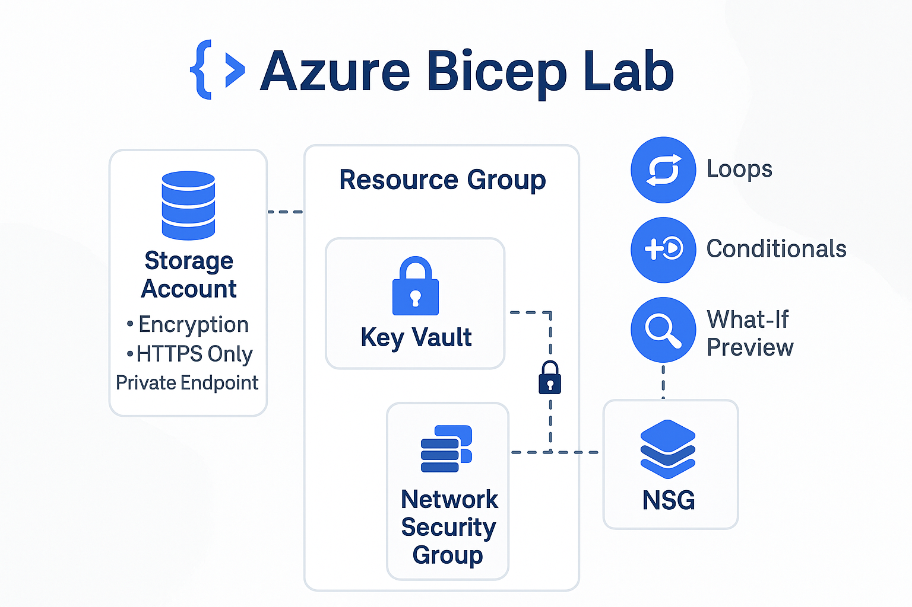

## Azure Bicep IaC: Secure Storage, Secrets & Advanced Deployments

Automating secure and dynamic cloud infrastructure on Azure using Bicep (Microsoft's native IaC language).  
This project provisions a Storage Account and Key Vault with best-practice security settings—and now, also demonstrates advanced Bicep features that are in high demand for modern Azure automation roles.

---

## Table of Contents

- [Overview](#overview)
- [Real-World Risk](#real-world-risk)
- [What I Built](#what-i-built)
- [Diagram](#diagram)
- [Objectives](#objectives)
- [Steps Performed](#steps-performed)
  - [1. Project Setup]
  - [2. Resource Group Creation]
  - [3. Secure Storage Account Deployment]
  - [4. Secure Key Vault Deployment]
  - [5. Advanced Bicep: Loops, Conditionals & What-If]
  - [6. Validation in Azure Portal]
  - [7. Cleanup]
- [Advanced Mini Labs Functions](#advanced-mini-labs-functions)
  - [1. Native Azure Functions]
  - [2 Native Resource Loops]
  - [3 Inline 'if' Conditionals]
  - [4. Native "What-If" Deployments]
  - [5. Other Azure Native Bicep Features]
- [Screenshots](#screenshots)
- [Lessons Learned](#lessons-learned)
- [Notes and Limitations](#notes-and-limitations)
- [References](#references)
- [Contact](#contact)

---

## Overview

This lab demonstrates secure Infrastructure as Code (IaC) and Azure Portal workflows to provision **a secure Storage Account and Key Vault** in Azure.  
Security best practices: tagging, disables public access, enforces HTTPS/TLS 1.2, enables encryption at rest and uses least-privilege access for secrets.  
*Both Bicep (IaC) and manual portal steps are shown, with troubleshooting documented.*

---

## Real-World Risk

Storing sensitive data or secrets in the cloud without secure configuration can expose organizations to serious threats—data leaks, credential theft, compliance violations and ransomware. Misconfigured storage or vaults are a top source of breaches, making “secure by default” IaC and validation essential for any modern cloud deployment.

---

## What I Built

This lab demonstrates secure Infrastructure as Code (IaC) and portal workflows for deploying a Storage Account and Key Vault in Azure, with robust security defaults and automation.  

**Bonus:** Includes a mini-lab demonstrating **advanced Bicep features** (native functions, resource loops, inline conditionals and what-if deployment preview), demonstrating high-value, real-world automation skills.

---

## Diagram



---

## Objectives

- Automate and/or manually deploy secure storage and secrets infrastructure in Azure.
- Apply strong security settings for data at rest and in transit.
- Show both IaC and portal skills (with screenshots and code evidence).
- Demonstrate advanced Bicep features: native loops, conditionals, and safe deployment preview.
- Document process and lessons for portfolio/interviews.

---

## Steps Performed

### 1. Project Setup
- Designed a modular Azure Bicep project, structuring code and screenshots for reusability and clarity *(Screenshot: `secure-folder-setup.png`)*

### 2. Resource Group Creation
- Deployed the `lab3-secure-rg` resource group in Azure using Bicep *(Screenshot: `resource-group-created.png`)*

### 3. Secure Storage Account Deployment
- Authored and validated Bicep IaC templates for secure Storage Account creation, leveraging native Azure functions for region and naming *(Screenshots: `main.png` & `storage-module-final.png`)*
- **Key security features implemented in IaC:**  
  - Secure transfer (HTTPS) enforced  
  - TLS 1.2 minimum  
  - Encryption at rest (Microsoft-managed keys)  
  - Tagging for traceability
- Demonstrated cloud flexibility by also deploying the Storage Account in the portal, confirming settings matched Bicep intent *(Screenshot: `storage-account-encryption.png`)*

### 4. Secure Key Vault Deployment
- Authored Bicep modules for secure Key Vault deployment with dynamic tenant and region assignment, using Azure-native Bicep features *(Screenshots: `keyvault-module.png` & `keyvault-module-extra.png`)*
- Configured granular access policies and advanced security in Bicep and portal as part of validation:
  - User access policy (Get, List, Set, Delete)
  - Soft-delete and purge protection *(Screenshots: `keyvault-overview.png`, `keyvault-access-policies.png`, `keyvault-properties.png`)*

### 5. Validation in Azure Portal
- Verified Storage Account(s) and Key Vault existence, region, and configuration in the Azure portal as proof of success *(Screenshots: `resource-group-overview.png`, `storage-accounts-looped.png`)*

### 6. Cleanup
- Deleted the Resource Group to avoid unnecessary cloud costs.
- Retained IaC code and documentation as a reusable, production-ready template for secure Azure deployments.

---

## Advanced Mini Labs Functions

**Why this matters:**  
These advanced Bicep features showcase skills highly valued by Azure recruiters, proving you can deliver cloud-native, dynamic and safe automation.

**Scenario:**  
Provision multiple Storage Accounts in a single deployment, but only in non-production environments, with a safe preview before applying.

### **Key Features Demonstrated**

| Feature                                 | How Demonstrated                                                |
|-----------------------------------------|-----------------------------------------------------------------|
| 1 **Native Azure Functions**            | Uses `resourceGroup().location` and `tenant().tenantId` in code |
| 2 **Native Resource Loops**             | Deploys multiple storage accounts from an array in Bicep        |
| 3 **Inline Conditionals (`if`)**        | Only deploys resources when not in 'prod' environment           |
| 4 **Native "What-If" Deployments**      | Safely previews changes before applying them                    |

---

### 1. Native Azure Functions 

**Dynamically using the resource group’s location and Azure subscription tenantId in your deployment**, which is awkward/impossible in other IaC tools *(Screenshot: `keyvault-module-extra.png`)*

> *This approach provides truly dynamic, cloud-context-aware deployments, something unique to Azure Bicep and not natively possible in Terraform or CloudFormation.*

---

### 2. & 3. Native Resource Loops + Inline Conditionals 

- Deploy multiple resources from an array in a single statement, based on environment *(Screenshots: `advanced-bicep-intellisense.png` & `storage-accounts-looped.png`)*

### **Sample Bicep (advanced-features.bicep)**

```bicep
param environment string = 'dev'
param storageAccountNames array = [
  'lab3devstorage01'
  'lab3devstorage02'
]

resource storageAccounts 'Microsoft.Storage/storageAccounts@2022-09-01' = [for name in storageAccountNames: if (environment != 'prod') {
  name: name
  location: resourceGroup().location
  sku: {
    name: 'Standard_LRS'
  }
  kind: 'StorageV2'
  properties: {
    minimumTlsVersion: 'TLS1_2'
    supportsHttpsTrafficOnly: true
  }
  tags: {
    Environment: environment
    DeployedBy: 'Bicep'
  }
}]
```
---

### 4. Safe "What-If" Preview 

- Safely preview all changes before deployment:

```powershell 
az deployment group what-if --resource-group lab3-bicep-advanced --template-file advanced-features.bicep --parameters environment='dev'
```

- Result in CLI: See all changes before you deploy *(Screenshot: what-if-preview-storage.png)*
- Result in Azure Portal: Both storage accounts appear, demonstrating deployment via loop *(Screenshot: storage-accounts-looped.png)*

---

## Other Azure Native Bicep Features

- **Instant access to latest Azure resource types and API versions** (always up to date, no provider lag)
- **Strongly-typed modules** — Bicep validates parameter types and references across modules natively.
- **Direct resource property references** (including cross-module)
- **No state file required** — deployments are always in sync with the Azure Resource Manager.
- **Secure secrets integration** — natively reference Key Vault secrets at deployment.

---

## Screenshots

*All screenshots are included in the `screenshots/` folder.*

| Step | Filename                         | Description                                                     |
|------|----------------------------------|-----------------------------------------------------------------|
| 1    | secure-folder-setup.png          | Project folder and file setup                                   |
| 2    | resource-group-created.png       | Resource group created in Azure                                 |
| 3    | storage-account-encryption.png   | Storage Account encryption & security settings                  |
| 3    | storage-module-final.png         | Bicep Storage Account module code                               |
| 4    | keyvault-overview.png            | Key Vault created, overview in portal                           |
| 4    | keyvault-access-policies.png     | Key Vault access policies (user permissions)                    |
| 4    | keyvault-properties.png          | Key Vault properties: soft-delete, purge protection             |
| 4    | keyvault-module.png              | Key Vault IaC module code (original)                            |
| 4    | keyvault-module-extra.png        | Key Vault IaC module code (with advanced features)              |
| 5    | advanced-bicep-intellisense.png  | Bicep code with native loops & inline conditionals in VS Code   |
| 5    | what-if-preview-storage.png      | “What-If” deployment output: safe preview of changes            |
| 5    | storage-accounts-looped.png      | Azure portal: both storage accounts created using Bicep loop    |
| 6    | resource-group-overview.png      | Both resources present in the resource group                    |
| --   | main.png                         | main.bicep code (overall template)                              |
| --   | deployment-command.png           | CLI deployment command/output (for IaC attempt)                 |
| --   | minilab-keyvault-portal.png      | Mini-lab: Key Vault in portal (shows region, RG)                |

---

## Lessons Learned

- **Hierarchical namespace (Data Lake Gen2)** can only be enabled at storage account creation.  
- Troubleshooting IaC vs. portal workflows is real-world cloud engineering.  
- Secure-by-default configuration is critical: always enforce encryption, HTTPS and least privilege.
- Advanced Bicep (loops, conditionals, what-if) enables truly dynamic, repeatable and safe infrastructure provisioning.

---

## Notes and Limitations

- Portal steps were used when IaC failed; all secure settings were still applied.
- In production, all steps should be automated with IaC.
- Resource names must be globally unique in Azure.

---

## References

- [Azure Bicep Documentation](https://learn.microsoft.com/en-us/azure/azure-resource-manager/bicep/)
- [Azure Storage Security Guide](https://learn.microsoft.com/en-us/azure/storage/common/storage-security-guide)
- [Azure Key Vault Security](https://learn.microsoft.com/en-us/azure/key-vault/general/security-features)

---

## Contact

Sebastian Silva C. – August, 2025 – Berlin, Germany  
- [LinkedIn](https://www.linkedin.com/in/sebastiansilc/)  
- [GitHub](https://github.com/SebaSilC)  
- [sebastian@playbookvisualarts.com](mailto:sebastian@playbookvisualarts.com)
